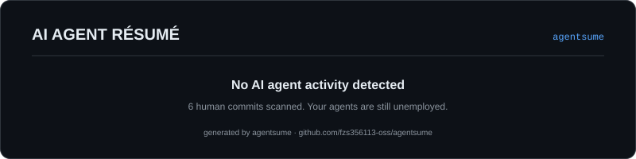

<div align="center">



# agentsume

**A résumé and performance review for your AI coding agents — generated from real git history.**

You pair with Claude Code, Codex, Copilot, Cursor all day — but nobody tracks *their* work.
agentsume scans your commit trailers and turns them into a shareable SVG performance card:
commits, lines touched, weekly activity, and a grade for every agent you employ.

`zero dependencies` · `one command` · `one SVG card`

[](https://github.com/fzs356113-oss/agentsume/actions/workflows/ci.yml)
[](./LICENSE)
[](./package.json)

[Quick Start](#quick-start) · [GitHub Action](#use-it-as-a-github-action) · [How Grading Works](#how-grading-works) · [中文说明](#中文说明)

</div>

## Why

AI agents already introduce themselves into your commit history:

```
🤖 Generated with Claude Code

Co-Authored-By: Claude <noreply@anthropic.com>
```

That's a **timesheet**. agentsume turns it into a résumé — for your agents, not for you.

## Quick start

Scan the repo you are in, get `agentsume.svg`:

```bash
npx github:fzs356113-oss/agentsume
```

No npm install, no config, no API key — it only reads your local git log.

Or clone and run:

```bash
git clone https://github.com/fzs356113-oss/agentsume
cd agentsume
node agentsume.js                     # scan cwd
node agentsume.js /path/to/repo -o card.svg --weeks 26 --theme light
node agentsume.js --json               # machine-readable stats
```

Then embed the card anywhere:

```markdown

```

## Use it as a GitHub Action

Put this in your profile repo (or any repo) to keep the card fresh automatically:

```yaml
- uses: fzs356113-oss/agentsume@v0.1.0
  with:
    weeks: 26      # activity window
    output: agentsume.svg
    commit: true    # commit the card back to the repo
```

See [examples](./examples/card.svg) of the output, or check
[`.github/workflows/update-card.yml`](./.github/workflows/update-card.yml) — this repo refreshes its own card every week.

## What it detects

| Agent | Traces it looks for |
|---|---|
| Claude Code | `Generated with Claude Code`, `Co-Authored-By: Claude <noreply@anthropic.com>` |
| Codex CLI | `Generated with Codex`, `Co-Authored-By: Codex <noreply@openai.com>` |
| GitHub Copilot | `Co-authored-by: Copilot <198982749+Copilot@users.noreply.github.com>` |
| Cursor | `Generated with Cursor`, `Cursor Agent` trailers |
| Gemini CLI | `Co-authored-by: Gemini CLI` trailers |
| Aider | `aider:` commit prefix |
| Windsurf | `Generated with Windsurf`, Codeium trailers |
| OpenCode / Trae / Crush | their `Generated with …` / co-author trailers |

A commit can credit multiple agents — everyone gets paid.

## How grading works

Every agent gets a letter grade from three signals:

- **Volume** — commits it drove (20 / 50 / 100+)
- **Recency** — days since its last commit (7 / 30 / 90)
- **Share** — its slice of all AI-assisted commits (20% / 50%)

| Grade | Meaning |
|---|---|
| **S** | Core contributor. Basically staff at this point. |
| **A** | Reliable senior. You ship together. |
| **B** | Solid mid. Useful on the right tickets. |
| **C** | Intern energy. Needs supervision. |

## CLI options

```
agentsume [repo] [options]

-o, --out <file>     output SVG path (default: agentsume.svg)
-w, --weeks <n>      weeks shown in the activity timeline (default: 26)
-t, --theme <name>   dark | light (default: dark)
    --since <date>   only scan commits since this git date
    --json           print stats as JSON instead of writing a card
-h, --help           show help
```

## 中文说明

**agentsume — 给你的 AI 编程助手们生成一份“简历 + 绩效考核”。**

你天天和 Claude Code、Codex、Copilot 结对干活，但从来没人统计过“它们”的产出。
agentsume 扫描 git 提交记录里的 agent 签名（`Co-Authored-By` 尾注、`Generated with` 标记等），
把散落的历史变成一张可以晒的 SVG 绩效卡：提交数、改动行数、每周活跃度，以及每个 agent 的评级。

**一行命令，零依赖，无需任何 API Key：**

```bash
npx github:fzs356113-oss/agentsume
```

也可以在 GitHub Actions 里定时刷新（配置见上方 [GitHub Action](#use-it-as-a-github-action) 章节），
把生成的 `agentsume.svg` 嵌进你的 README，让你的 agent 团队替你“卷 KPI”。

评级规则：按 **产出量**（提交数）、**近期活跃**（距最近一次提交天数）、**占比**（在所有 AI 提交中的份额）
三项打分，得出 S / A / B / C——S 级是核心骨干，C 级还需要你盯着干活的实习生。

支持的 agent：Claude Code、Codex CLI、GitHub Copilot、Cursor、Gemini CLI、Aider、Windsurf、OpenCode、Trae、Crush。
一个提交可以同时署名多个 agent，大家都有份。

## Contributing

Missing your favorite agent? Add its signature to [`lib/detect.js`](./lib/detect.js) and open a PR.
Theme tweaks live in [`lib/render.js`](./lib/render.js). Tests run with plain Node:

```bash
node test/test.js
```

## License

[MIT](./LICENSE)
